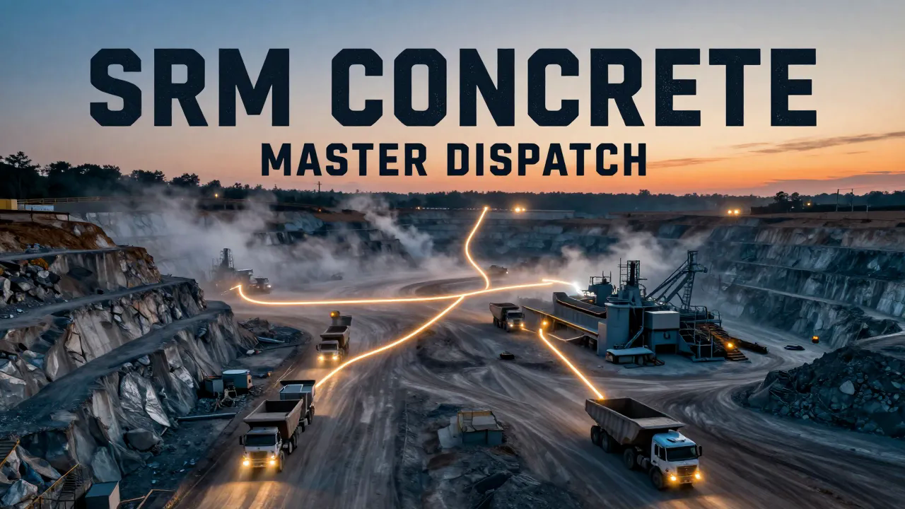
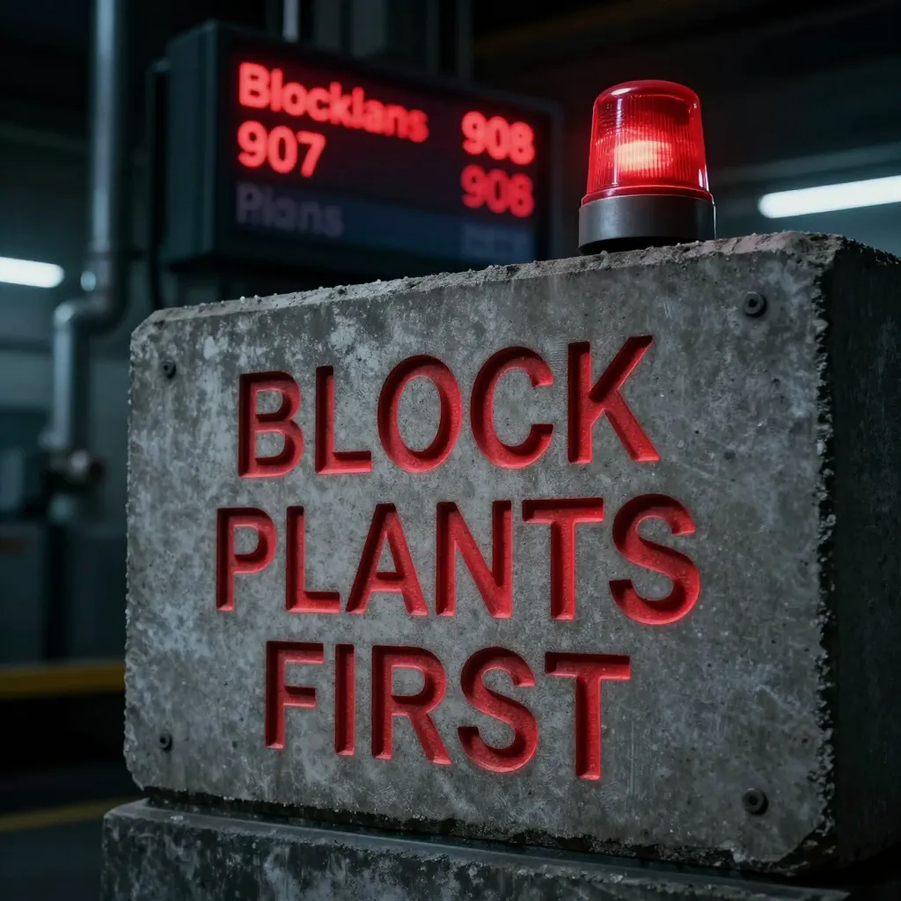
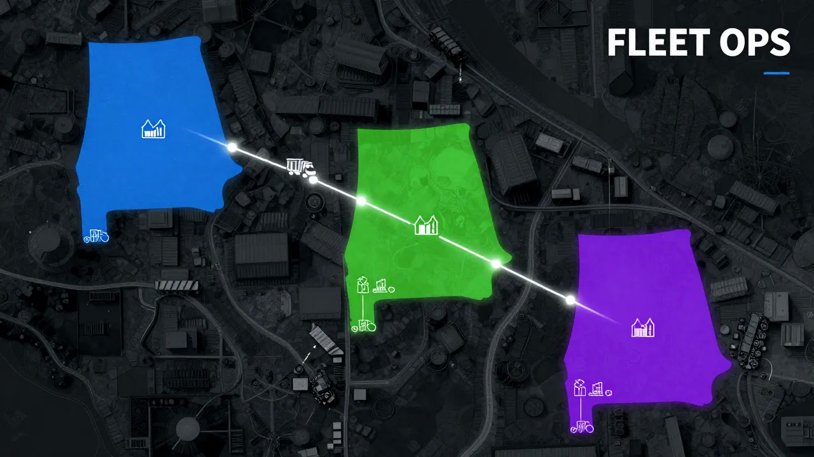
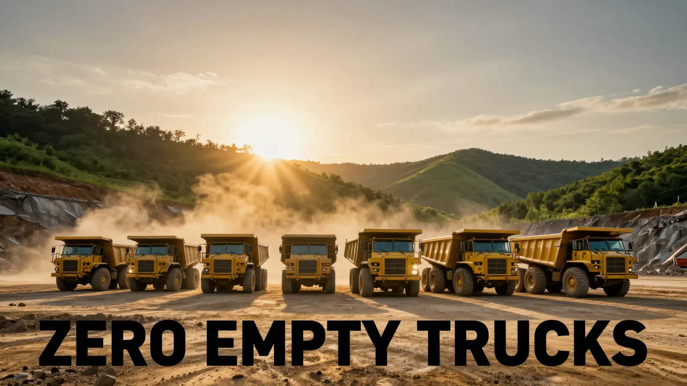

<div align="center">


# MASTER Scheduler Dashboard — SRM Concrete

**Unified dispatch routing, scheduling, and management for North Alabama's fleet.**

[](https://github.com/thebardchat/constitution)
[](https://github.com/thebardchat/MASTER-Scheduler-Dashboard-SRM)
[](https://github.com/thebardchat/MASTER-Scheduler-Dashboard-SRM)
[](https://github.com/thebardchat/MASTER-Scheduler-Dashboard-SRM)
[](https://github.com/thebardchat/MASTER-Scheduler-Dashboard-SRM)

*Maximizes loads to plants. Keeps block plants fed. Zero empty trucks.*

*Hazel Green, Alabama*

</div>

---

## What It Does

A consolidated operations platform that combines:

- **Dispatch Router** — Daily route generation for 16+ triaxle dump truck drivers across North Alabama quarries and concrete plants
- **Load Maximizer** — Routes prioritize plants that have NO outside hauler help (block plants 907, 908) before all others
- **Management Dashboard** — SOPs, personnel tracking, coaching tools, performance audits
- **Scheduling System** — Driver clock-in times, parking assignments, copy-to-text dispatch

### The Core Problem It Solves

<div align="center">

</div>

Some plants get outside haulers delivering sand or rock. Block plants (907, 908) get **zero** outside help — every load they receive comes from an SRM truck. This system ensures block plants are never starved while still keeping all other plants supplied efficiently.

### Outside Help Map

| Plant | Gets Outside Sand | Gets Outside Rock | SRM Fleet Responsibility |
|-------|:-:|:-:|---|
| 507 Stringfield | ✅ | ❌ | Rock only |
| 508 Nick Fitcheard | ✅ | ❌ | Rock only |
| 518 Scottsboro | ✅ | ❌ | Rock + BP 1/4 downs |
| 525 Cullman | ✅ | ❌ | Rock only |
| 516 Lacey Spring | ❌ | ✅ | Sand + scrap backhaul |
| **907 Palmer Block** | ❌ | ❌ | **Everything** |
| **908 Block Plant** | ❌ | ❌ | **Everything** |
| All others | ❌ | ❌ | Full service |

---

<div align="center">

</div>

## The Fleet

**16 active drivers + 1 dispatch manager backup:**

| Crew | Drivers | Home Base |
|------|---------|-----------|
| 507 (North) | Marcus · Brittany · Eboni · Deletra | Huntsville |
| 519 (Central) | Charlie · Bryant · Jamie · Eddie | Muscle Shoals |
| 506 (West) | Kenny · Jimmy · Roberto · Jonathon | Decatur |
| Fixed BP | Stacey · Alexis | 511 / 516 |
| Dump Trailer | CHRIS P (fixed route) · Tim | CHER / 519 |
| Backup | Curtis (dispatch mgr) | Office / 525 |

---

<div align="center">

</div>

## Key Routes

**CHRIS P (never modify):**
`CHER → MSAND → Tupelo Block → APAC Tremont → 511 → POD → 519 → PRELOAD`

**Standard Morning (all triaxle):**
`Home → Scrap → Quarry (check loader: good/bad pile) → Backhaul rock → Assigned plant → Backhaul loop → Preload end of day`

**Tuesday/Friday Override:**
Special BP + block plant supply runs. 519 crew delivers MH 67s across plants. 507 crew delivers POD sand + BP 1/4 downs + 907 blocks.

**Bridgeport Rotation:**
Groups A/B/C rotate on `cycleDay % 3`. Stacey + Alexis always on BP. Max 1x/week per driver.

---

## Stack

| Layer | Tech |
|-------|------|
| Framework | React 18 + Vite 5 |
| UI | Vanilla CSS · mobile-first |
| State | Client-side only (no backend) |
| PWA | vite-plugin-pwa · offline-capable |
| Build | Vite |
| Deploy | GitHub Pages · Pi 5 LAN |

---

## Running Locally

```bash
git clone https://github.com/thebardchat/MASTER-Scheduler-Dashboard-SRM.git
cd MASTER-Scheduler-Dashboard-SRM
npm install
npm run dev
```

Runs on `localhost:5173`.

## Running on Raspberry Pi 5

```bash
ssh shane@100.67.120.6
cd /mnt/shanebrain-raid/shanebrain-core/
git clone https://github.com/thebardchat/MASTER-Scheduler-Dashboard-SRM.git
cd MASTER-Scheduler-Dashboard-SRM
npm install && npm run build
npx serve dist -p 3031
```

Access at `http://10.0.0.42:3031` on LAN or via Tailscale.

---

## Hardware

| Component | Spec |
|-----------|------|
| **Raspberry Pi 5** | 16GB RAM · local dev + hosting |
| **Pironman 5-MAX** | NVMe RAID 1 (2× WD Blue SN5000 2TB) |
| **Pulsar0100** | N8N bridge · dev workstation |
| **SAMSARA** | GPS/telematics (fleet install in progress) |

---

## Repo Structure

```
├── CLAUDE.md              ← Claude Code context (update every session)
├── README.md              ← this file
├── package.json
├── vite.config.js
├── index.html
├── src/
│   ├── App.jsx            ← dispatch UI
│   ├── config/
│   │   ├── crew.js        ← drivers, BP groups, rotations
│   │   ├── plants.js      ← plant codes, outside help, subs
│   │   └── distances.js   ← drive time matrix
│   ├── utils/
│   │   ├── shorthand.js   ← route generation engine
│   │   └── rotation.js    ← rotation logic
│   └── components/
├── SOPs/                  ← operational procedures
├── personnel/             ← performance tracking
├── scripts/               ← coaching & training tools
├── affirmations/          ← morning fire
└── docs/
    └── master-plan.md     ← mega dashboard roadmap
```

---

## Consolidated From

| Repo | What It Contributed |
|------|-------------------|
| `thebardchat/srm-dispatch` | Route engine, crew config, distance matrix, PWA shell |
| SRM Management OS | SOPs, personnel tools, coaching, affirmations, dashboard |
| Master Plan | Roadmap, phased build plan, system requirements |

---

## Roadmap

- [x] CLAUDE.md + README.md for Claude Code
- [ ] Merge source repos into unified structure
- [ ] Load priority engine (block plants first)
- [ ] Add 908 to plant config
- [ ] Plant needs dashboard (what each plant needs today)
- [ ] Load counter (SRM loads vs outside loads per plant)
- [ ] SAMSARA GPS integration
- [ ] Weekly fairness report
- [ ] Talk-to-text order entry
- [ ] Automated phone dispatch

---

## Built With

<table>
  <tr>
    <td align="center" width="200">
      <b>Claude by Anthropic</b><br/>
      <sub>AI partner and co-builder.</sub><br/><br/>
      <a href="https://claude.ai"><code>claude.ai</code></a>
    </td>
    <td align="center" width="200">
      <b>Raspberry Pi 5</b><br/>
      <sub>Local AI compute node.</sub><br/><br/>
      <a href="https://www.raspberrypi.com"><code>raspberrypi.com</code></a>
    </td>
    <td align="center" width="200">
      <b>Pironman 5-MAX</b><br/>
      <sub>NVMe RAID 1 chassis by Sunfounder.</sub><br/><br/>
      <a href="https://www.sunfounder.com"><code>sunfounder.com</code></a>
    </td>
  </tr>
</table>

---

<div align="center">

*Built by a dispatcher, for a dispatcher. Every feature solves a real daily problem.*

*Part of the [ShaneBrain Ecosystem](https://github.com/thebardchat) · Built under the [Constitution](https://github.com/thebardchat/constitution)*

</div>
